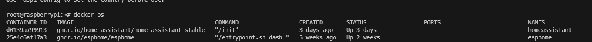
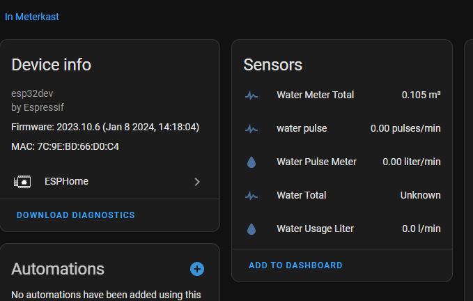

# Water meter

This project will show you how you can create your own water meter using ESPHome, Homeassistant for software and an ESP32 plus proximity sensor as hardware.

## Step 1 Gather parts

Hardware Parts required

- ESP32
- Proximity sensor (I'm using LJ18A3-8-Z/BX-5)

Optional: I created a [3d printable design](https://www.tinkercad.com/things/3jqyKvCy5m8-watermeter) to fit on top of your water meter. Feel free to use it yourself or alter it according to your needs! I highly recomment to take measurements before printing.

Software required: Homeassistant, ESPHome

## Step 2 Wire Sensor to ESP32

Wire the proximity sensor so that it matches the scheme in the table.

Simplified table
| Wire | Terminal |
|---|---|
| Blue | Ground |
| Brown | Live, 5v. |
| Black | GPIO |

I you connect it to a different GPIO pin, make sure to update the sensors.yaml with your pin.

## Step 3 Flashing

Flash the ESPHome firmware via your pc, connecting it to yout ESPHome instance. (https://web.esphome.io/)

I am running ESPHome on a docker container running on my Raspberry PI 4B. I followed the instructions [here](https://esphome.io/guides/getting_started_command_line).

## Step 4 Configuring Proximity sensor

Once set in ESPHome, add the sensors to the bottom YAML, by clicking edit on your ESP in ESPHome. Finally click save, then install to push the changes to your ESP. If it does not install, please check the syntax and otherwise run it through a YAML Linter to see what is wrong.

## Step 5 Integrating with Homeassistant

Add an integration inside your homeassistant named ESPHome, define the host and port and enter the correct credentials. These will only be shown once during setup of ESPHome, so hopefully you still have them :D.

After adding your ESPHome instance to homeassistant, you should see the device, with it's sensors.

